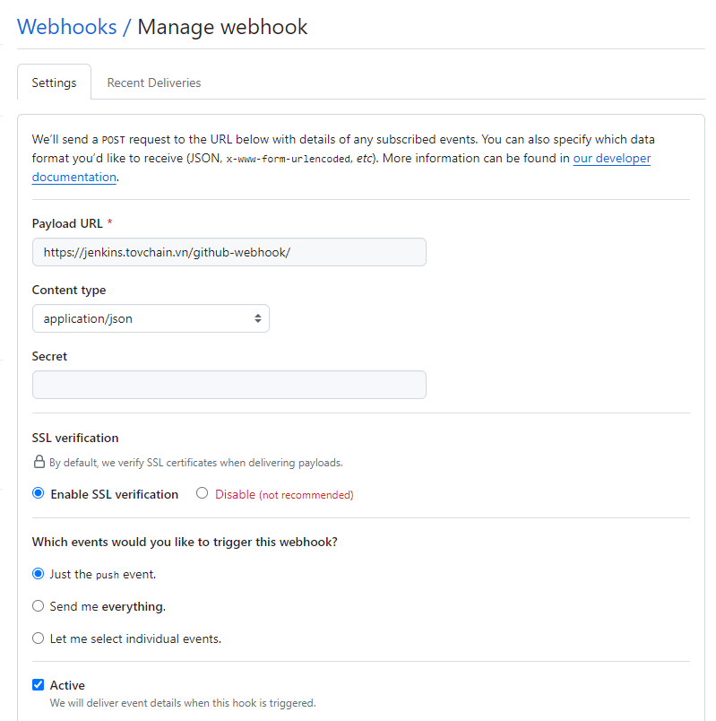
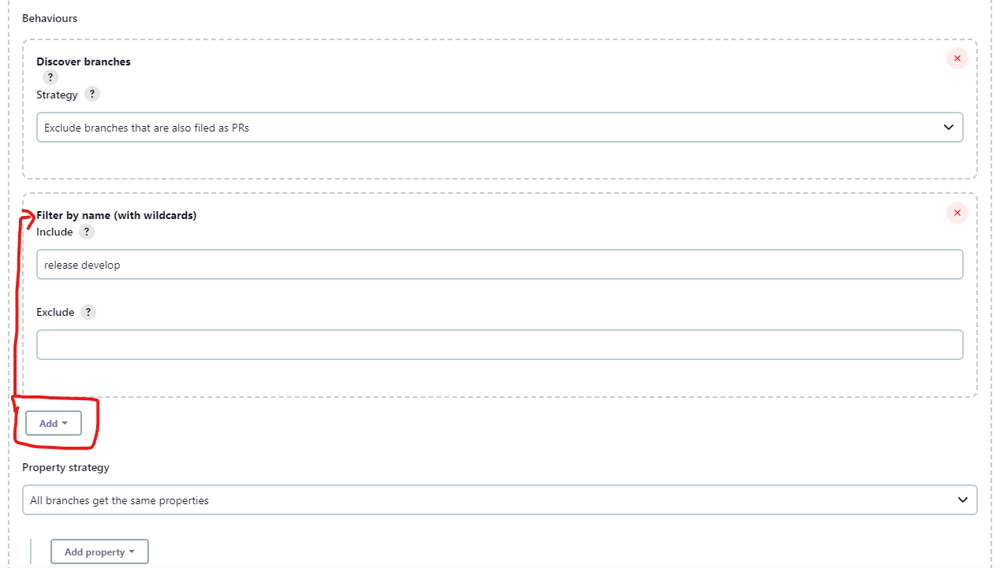
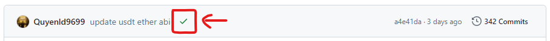

# Build jenkins with docker

## docker-compose file

```yml
version: "3"

services:
    jenkins:
        image: jenkins/jenkins:lts
        container_name: jenkins
        ports:
            - "8181:8080"
            - "50000:50000"

        volumes:
            - ./jenkins:/var/jenkins_home
        user: root
    nginx:
        image: nginx:latest
        container_name: nginx-jenkins
        ports:
            - "80:80"
            - "443:443"
        volumes:
            - ./nginx/nginx.conf:/etc/nginx/conf.d/jenkins.conf
            - /path/to/certs:/etc/certs
```

## nginx.conf file

```conf
server {
    listen 443 ssl;
    server_name jenkins.quyenvip.click;

    ssl_certificate /etc/certs/domain.crt;
    ssl_certificate_key /etc/certs/domain.key;

    location / {
            proxy_pass http://[hostname -i]:8181;
            proxy_set_header Host $host;
            proxy_set_header X-Real-IP $remote_addr;
            proxy_set_header X-Forwarded-Proto $scheme;
            proxy_set_header X-Forwarded-For $proxy_add_x_forwarded_for;
            proxy_ssl_verify off;
    }
}
```

This config nginx alow **ssl** for jenkins

## CI-CD

### Setup jenkins file for project

```Jenkinsfile
pipeline {
    agent any

    options {
        timeout(time: 20, unit: "MINUTES")
        timestamps()
        retry(1)
    }

    environment {
        // Docker registry url
        REGISTRY = "..."

        // Username for Docker registry
        USERNAME = "..."

        // Name of organization, team, project, etc..
        ORGANIZATION_NAME = "..."

        // Name of repository, application, etc..
        REPOSITORY_NAME = "..."

        // Staging server information
        STAGING_VM_IP = "..."
        STAGING_URL = "..."
        STAGING_DOCKER_PORT = ...
        STAGING_DOCKER_BIND_PORT = ...
        STAGING_ENV_CREDENTIALS_ID = '...'

        // Production server information
        PRODUCTION_VM_IP = "..."
        PRODUCTION_URL = "..."
        PRODUCTION_DOCKER_PORT = ...
        PRODUCTION_DOCKER_BIND_PORT = ...
        PRODUCTION_ENV_CREDENTIALS_ID = '...'

        // Configuation
        DEPLOY_PRODUCTION_MODE = "auto"

        // CredentialsId
        DISCORD_CREDENTIALS_ID = "..."
    }

    stages {
        stage("Preparation") {
            steps {
                script {
                    env.COMMIT_MESSAGE = sh(returnStdout: true, script: "git log -1 --pretty=%B").trim()
                    env.DEPLOY_COMMIT_HASH = sh(returnStdout: true, script: "git rev-parse HEAD | cut -c1-7").trim()
                    switch(env.BRANCH_NAME) {
                        case "develop":
                            echo "BRANCH_NAME is ${env.BRANCH_NAME}"
                            script {
                                env.ENVIRONMENT = "staging"
                                env.DEPLOY_VM_IP = "${STAGING_VM_IP}"
                                env.DEPLOY_URL = "${STAGING_URL}"
                                env.DOCKER_PORT = "${STAGING_DOCKER_PORT}"
                                env.DOCKER_BIND_PORT = "${STAGING_DOCKER_BIND_PORT}"
                                env.ENV_CREDENTIALS_ID = "${STAGING_ENV_CREDENTIALS_ID}"
                            }
                            break
                        case "release":
                            echo "BRANCH_NAME is ${env.BRANCH_NAME}"
                            script {
                                env.ENVIRONMENT = "production"
                                env.DEPLOY_VM_IP = "${PRODUCTION_VM_IP}"
                                env.DEPLOY_URL = "${PRODUCTION_URL}"
                                env.DOCKER_PORT = "${PRODUCTION_DOCKER_PORT}"
                                env.DOCKER_BIND_PORT = "${PRODUCTION_DOCKER_BIND_PORT}"
                                env.ENV_CREDENTIALS_ID = "${PRODUCTION_ENV_CREDENTIALS_ID}"
                            }
                            break
                        case "master":
                            echo "BRANCH_NAME is ${env.BRANCH_NAME}"
                            script {
                                env.ENVIRONMENT = "tagging"
                                env.RELEASE_TAG = sh(returnStdout: true, script: "git tag --points-at HEAD").trim()
                            }
                            break
                        default:
                            currentBuild.result = "ABORTED"
                            return
                    }
                    env.IMAGE_NAME = "${REGISTRY}/${USERNAME}/${ORGANIZATION_NAME}-${REPOSITORY_NAME}-${env.ENVIRONMENT}:${env.DEPLOY_COMMIT_HASH}"
                    env.CONTAINER_NAME = "${ORGANIZATION_NAME}-${REPOSITORY_NAME}-${env.ENVIRONMENT}"
                }
            }
        }

        stage("Deploy to staging") {
            when {
                expression {
                    return env.ENVIRONMENT == "staging"
                }
            }

            stages {
                stage("Build staging image") {
                    steps {
                        echo "Build staging docker image ..."

                        withCredentials([string(credentialsId: "${DISCORD_CREDENTIALS_ID}", variable: "WEBHOOK_URL")]) {
                            discordSend(
                                description: "\n \
                                💿 **Image:** ${env.IMAGE_NAME} \n \n \
                                🐳 **Container:** ${env.CONTAINER_NAME} \n \n \
                                📟 **Commit Hash:** ${env.DEPLOY_COMMIT_HASH} \n \n \
                                📋 **Commit Message:** ${env.COMMIT_MESSAGE} \n \n \
                                🖥 **IP:** ${env.DEPLOY_VM_IP} \n \n \
                                ⏳ **Status:** Deploying \n \n \
                                🔗 **Link:** ${env.DEPLOY_URL} \n ",
                                footer: "Copyright © ...",
                                link: env.BUILD_URL,
                                result: "UNSTABLE",
                                title: "Start deploy **${ORGANIZATION_NAME}-${REPOSITORY_NAME}** to ${env.ENVIRONMENT} environment.",
                                webhookURL: WEBHOOK_URL
                            )
                        }

                        checkout scm

                        withCredentials([usernamePassword(credentialsId: 'docker-devopstovchain', passwordVariable: 'DOCKER_PASSWORD', usernameVariable: 'DOCKER_USERNAME'),
                                        file(credentialsId: "${env.ENV_CREDENTIALS_ID}", variable: 'ENV_FILE_STAGING')]) {
                            writeFile(file: ".env", text: readFile("${ENV_FILE_STAGING}"), encoding: "UTF-8")
                            sh "docker build -t ${env.IMAGE_NAME} . && \
                                docker login -u ${DOCKER_USERNAME} -p ${DOCKER_PASSWORD} ${REGISTRY} && \
                                docker push ${env.IMAGE_NAME} && \
                                docker logout"
                        }
                    }
                }

                stage("Test staging image") {
                    steps {
                        echo "Testing..."
                        sh "sleep 1"
                        echo "Done!"
                    }
                }

                stage("Delivery to staging") {
                    steps {
                        echo "Delivery to ${env.ENVIRONMENT} environment..."

                        withCredentials([usernamePassword(credentialsId: 'docker-devopstovchain', passwordVariable: 'DOCKER_PASSWORD', usernameVariable: 'DOCKER_USERNAME')]) {
                            script {
                                env.LATEST_DEPLOY_COMMIT_HASH = sh(returnStdout: true, script: "ssh -o StrictHostKeyChecking=no -l root ${DEPLOY_VM_IP} 'docker ps --filter name=${env.CONTAINER_NAME} --format={{.Image}} | cut -d: -f2'").trim()
                            }

                            sh "ssh -o StrictHostKeyChecking=no -l root ${DEPLOY_VM_IP} \
                                'docker login -u ${DOCKER_USERNAME} -p ${DOCKER_PASSWORD} ${REGISTRY} && \
                                 docker pull ${env.IMAGE_NAME} && \
                                 docker rm -f ${env.CONTAINER_NAME} && \
                                 docker run -d --name ${env.CONTAINER_NAME} -p ${DOCKER_BIND_PORT}:${DOCKER_PORT} ${env.IMAGE_NAME} && \
                                 docker ps && \
                                 docker logout'"
                        }
                    }

                    post {
                        failure {
                            echo "Failure delivery to ${env.ENVIRONMENT} environment"
                            withCredentials([usernamePassword(credentialsId: 'docker-devopstovchain', passwordVariable: 'DOCKER_PASSWORD', usernameVariable: 'DOCKER_USERNAME')]) {
                                sh "ssh -o StrictHostKeyChecking=no -l root ${DEPLOY_VM_IP} \
                                    'docker rm -f ${env.CONTAINER_NAME} && \
                                     docker run -d --name ${env.CONTAINER_NAME} -p ${DOCKER_BIND_PORT}:${DOCKER_PORT} ${REGISTRY}/${USERNAME}/${ORGANIZATION_NAME}-${REPOSITORY_NAME}-${env.ENVIRONMENT}:${env.LATEST_DEPLOY_COMMIT_HASH} && \
                                     docker ps'"
                            }
                        }
                    }
                }
            }
        }

        stage("Deploy to production") {
            when {
                expression {
                    return env.ENVIRONMENT == "production"
                }
            }

            stages {
                stage("Build production image") {
                    steps {
                        echo "Build ${env.ENVIRONMENT} docker image ..."

                        withCredentials([string(credentialsId: "${DISCORD_CREDENTIALS_ID}", variable: "WEBHOOK_URL")]) {
                            discordSend(
                                description: "\n \
                                💿 **Image:** ${env.IMAGE_NAME} \n \n \
                                🐳 **Container:** ${env.CONTAINER_NAME} \n \n \
                                📟 **Commit Hash:** ${env.DEPLOY_COMMIT_HASH} \n \n \
                                📋 **Commit Message:** ${env.COMMIT_MESSAGE} \n \n \
                                🖥 **IP:** ${env.DEPLOY_VM_IP} \n \n \
                                ⏳ **Status:** Deploying \n \n \
                                🔗 **Link:** ${env.DEPLOY_URL} \n ",
                                footer: "Copyright © ...",
                                link: env.BUILD_URL,
                                result: "UNSTABLE",
                                title: "Start deploy **${ORGANIZATION_NAME}-${REPOSITORY_NAME}** to ${env.ENVIRONMENT} environment.",
                                webhookURL: WEBHOOK_URL
                            )
                        }

                        checkout scm

                        withCredentials([usernamePassword(credentialsId: 'docker-devopstovchain', passwordVariable: 'DOCKER_PASSWORD', usernameVariable: 'DOCKER_USERNAME'),
                                         file(credentialsId: "${env.ENV_CREDENTIALS_ID}", variable: 'ENV_FILE_PRODUCTION')]) {
                            writeFile(file: ".env", text: readFile("${ENV_FILE_PRODUCTION}"), encoding: "UTF-8")
                            sh "docker build -t ${env.IMAGE_NAME} . && \
                                docker login -u ${DOCKER_USERNAME} -p ${DOCKER_PASSWORD} ${REGISTRY} && \
                                docker push ${env.IMAGE_NAME} && \
                                docker logout"
                        }
                    }
                }

                stage("Test production image") {
                    steps {
                        echo "Testing..."
                        sh "sleep 1"
                        echo "Done!"
                    }
                }

                stage("Delivery to production") {
                    steps {
                        script {
                            if (DEPLOY_PRODUCTION_MODE == 'manual') {
                                input message: 'Deploy to production environment?'
                            }
                        }

                        echo "Delivery to ${env.ENVIRONMENT} environment..."

                        withCredentials([usernamePassword(credentialsId: 'docker-devopstovchain', passwordVariable: 'DOCKER_PASSWORD', usernameVariable: 'DOCKER_USERNAME')]) {
                            script {
                                env.LATEST_DEPLOY_COMMIT_HASH = sh(returnStdout: true, script: "ssh -o StrictHostKeyChecking=no -l root ${DEPLOY_VM_IP} 'docker ps --filter name=${env.CONTAINER_NAME} --format={{.Image}} | cut -d: -f2'").trim()
                            }

                            sh "ssh -o StrictHostKeyChecking=no -l root ${DEPLOY_VM_IP} \
                                'docker login -u ${DOCKER_USERNAME} -p ${DOCKER_PASSWORD} ${REGISTRY} && \
                                 docker pull ${env.IMAGE_NAME} && \
                                 docker rm -f ${env.CONTAINER_NAME} && \
                                 docker run -d --name ${env.CONTAINER_NAME} -p ${DOCKER_BIND_PORT}:${DOCKER_PORT} ${env.IMAGE_NAME} && \
                                 docker ps && \
                                 docker logout'"
                        }
                    }

                    post {
                        failure {
                            echo "Failure delivery to ${env.ENVIRONMENT} environment"
                            withCredentials([usernamePassword(credentialsId: 'docker-devopstovchain', passwordVariable: 'DOCKER_PASSWORD', usernameVariable: 'DOCKER_USERNAME')]) {
                                sh "ssh -o StrictHostKeyChecking=no -l root ${DEPLOY_VM_IP} \
                                    'docker rm -f ${env.CONTAINER_NAME} && \
                                     docker run -d --name ${env.CONTAINER_NAME} -p ${DOCKER_BIND_PORT}:${DOCKER_PORT} ${REGISTRY}/${USERNAME}/${ORGANIZATION_NAME}-${REPOSITORY_NAME}-${env.ENVIRONMENT}:${env.LATEST_DEPLOY_COMMIT_HASH} && \
                                     docker ps'"
                            }
                        }
                    }
                }
            }
        }

        // Tagging image
        stage("Tagging image") {
            when {
                expression {
                    return env.ENVIRONMENT == "tagging"
                }
            }
            steps {
                withCredentials([usernamePassword(credentialsId: 'docker-devopstovchain', passwordVariable: 'DOCKER_PASSWORD', usernameVariable: 'DOCKER_USERNAME')]) {
                    sh "ssh -o StrictHostKeyChecking=no -l root ${PRODUCTION_VM_IP} \
                        'docker login -u ${DOCKER_USERNAME} -p ${DOCKER_PASSWORD} ${REGISTRY} && \
                         docker tag \$(docker ps --filter name=${env.CONTAINER_NAME} --format={{.Image}}) ${env.IMAGE_NAME} ${REGISTRY}/${USERNAME}/${ORGANIZATION_NAME}-${REPOSITORY_NAME}:${env.RELEASE_TAG} && \
                         docker push ${REGISTRY}/${USERNAME}/${ORGANIZATION_NAME}-${REPOSITORY_NAME}:${env.RELEASE_TAG} && \
                         docker logout'"
                }
            }
        }
    }

    post {
        success {
            echo "Successful deployment to ${env.ENVIRONMENT}!"
            withCredentials([usernamePassword(credentialsId: 'docker-devopstovchain', passwordVariable: 'DOCKER_PASSWORD', usernameVariable: 'DOCKER_USERNAME')]) {
                sh "ssh -o StrictHostKeyChecking=no -l root ${DEPLOY_VM_IP} \
                    'docker container prune -f && \
                     docker image prune -af'"
            }
            withCredentials([string(credentialsId: "${DISCORD_CREDENTIALS_ID}", variable: "WEBHOOK_URL")]) {
                discordSend(
                    description: "\n \
                    💿 **Image:** ${env.IMAGE_NAME} \n \n \
                    🐳 **Container:** ${env.CONTAINER_NAME} \n \n \
                    📟 **Commit Hash:** ${env.DEPLOY_COMMIT_HASH} \n \n \
                    📋 **Commit Message:** ${env.COMMIT_MESSAGE} \n \n \
                    🖥 **IP:** ${env.DEPLOY_VM_IP} \n \n \
                    ✅ **Status:** Success \n \n \
                    🔗 **Link:** ${env.DEPLOY_URL} \n ",
                    footer: "Copyright © ...",
                    link: env.BUILD_URL,
                    result: currentBuild.currentResult,
                    title: "Successful deployment **${ORGANIZATION_NAME}-${REPOSITORY_NAME}** to ${env.ENVIRONMENT} environment.",
                    webhookURL: WEBHOOK_URL
                )
            }
        }

        failure {
            echo "Failure deployment to ${env.ENVIRONMENT}!"
            withCredentials([string(credentialsId: "${DISCORD_CREDENTIALS_ID}", variable: "WEBHOOK_URL")]) {
                discordSend(
                    description: "\n \
                    💿 **Image:** ${env.IMAGE_NAME} \n \n \
                    🐳 **Container:** ${env.CONTAINER_NAME} \n \n \
                    📟 **Commit Hash:** ${env.DEPLOY_COMMIT_HASH} \n \n \
                    📋 **Commit Message:** ${env.COMMIT_MESSAGE} \n \n \
                    🖥 **IP:** ${env.DEPLOY_VM_IP} \n \n \
                    ❌ **Status:** Fail \n \n \
                    🔗 **Link:** ${env.DEPLOY_URL} \n ",
                    footer: "Copyright © ...",
                    link: env.BUILD_URL,
                    result: currentBuild.currentResult,
                    title: "Failure deployment **${ORGANIZATION_NAME}-${REPOSITORY_NAME}** to ${env.ENVIRONMENT} environment.",
                    webhookURL: WEBHOOK_URL
                )
            }
        }
    }
}
```

### Add Webhook to Project GitHub

1. Go to "Settings" on project Github
2. Select Webhooks
3. Fill fields like image:

    

### Jenkins setup

1. Select multiple pipelines
2. On behavior branches, select similar image below:
   

> **Note**:
>
> -   DevOp public key need to be added on server deployment (to ssh to server to pull images docker)
> -   DevOp github account need to be added on project deploy, to view status of builing code
>     
