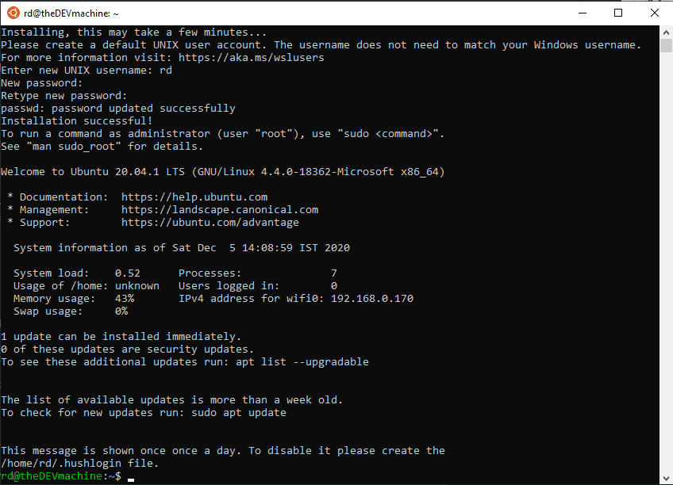
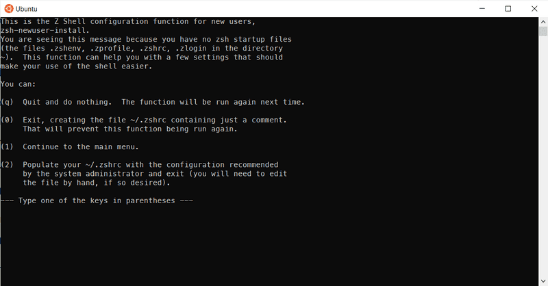
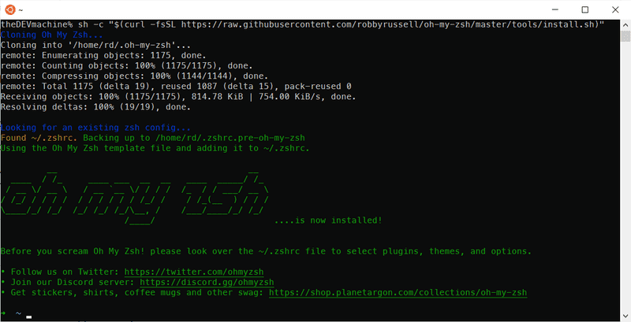

# Install zsh terminal for window

ubuntu terminal on window like this



## Install ZSH

```bash
sudo apt update && sudo apt upgrade -y
```

```bash
sudo apt-get install zsh
```

Make _zsh_ the default shell with following command:

```bash
chsh -s /usr/bin/zsh
```

Restart the Ubuntu app and you should be greeted with following screen:



## Install Oh my ZSH

Next, lets install 'OH MY ZSH' with following command:

```bash
sh -c "$(curl -fsSL https://raw.githubusercontent.com/robbyrussell/oh-my-zsh/master/tools/install.sh)"
```

Below is the screenshot of completed installation:


## PowerLevel10k

Install the recommended font 'Meslo Nerd Font':
Download font in path /font

Choose **Property** on terminal and select font "MesloLGS NF"

Installation of PowerLevel10k for Oh My Zsh:

```bash
git clone --depth=1 https://github.com/romkatv/powerlevel10k.git $ZSH_CUSTOM/themes/powerlevel10k
```

```bash
nano ~/.zshrc.
```

Set **ZSH_THEME="powerlevel10k/powerlevel10k"** in `~/.zshrc.`

Restart the Ubuntu app.
