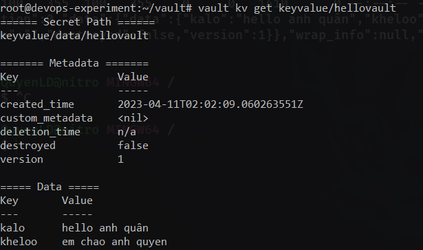

# Deploy Vault

Need: domain, nginx, docker-compose, certs

## Install Vault

```bash
wget -O- https://apt.releases.hashicorp.com/gpg | sudo gpg --dearmor -o /usr/share/keyrings/hashicorp-archive-keyring.gpg

echo "deb [signed-by=/usr/share/keyrings/hashicorp-archive-keyring.gpg] https://apt.releases.hashicorp.com $(lsb_release -cs) main" | sudo tee /etc/apt/sources.list.d/hashicorp.list

sudo apt update && sudo apt install vault
```

## Deploy production Vault

Prepare `.hcl` file

```hcl
    disable_mlock = true
    ui = true

    listener "tcp" {
        address     = "0.0.0.0:8200"
        tls_cert_file = "/root/vault/certs/domain.crt"
        tls_key_file = "/root/vault/certs/domain.key"
    }

    storage "file" {
        path = "/root/vault/data"
    }

    api_addr = "http://127.0.0.1:8200"
    cluster_addr = "https://127.0.0.1:8201"
```

Command:

```bash
    vault server -config=file-config.hcl
```

Read more in [`https://developer.hashicorp.com/vault/docs/configuration`](https://developer.hashicorp.com/vault/docs/configuration)

## Download certificate from cloudflare (client-certificates)

2 file named: domain.crt, domain.key

## Config nginx

Need map domain `ex: vault.quyenvip.click` to `port 8200` on server vault. This port is `ssl port`

```
server {
    listen 80;
    listen [::]:80;
    server_name vault.quyenvip.click;

    return 301 https://$server_name$request_uri;
}

server {
    listen 443 ssl;
    listen [::]:443 ssl;
    server_name vault.quyenvip.click;

    ssl_certificate /etc/certs/domain.crt;
    ssl_certificate_key /etc/certs/domain.key;

    location / {
        proxy_pass https://10.15.0.10:8200;
        proxy_set_header Host $host;
        proxy_set_header X-Real-IP $remote_addr;
        proxy_set_header X-Forwarded-Proto $scheme;
        proxy_set_header X-Forwarded-For $proxy_add_x_forwarded_for;
        proxy_ssl_verify off;
    }
}
```

`/etc/certs/domain.crt` and `/etc/certs/domain.key` is path in container.

Write docker-compose file

```
version: "3"

services:
  nginx:
    image: nginx:latest
    container_name: nginx-vault
    ports:
      - "80:80"
      - "443:443"
    volumes:
      - ./config.conf:/etc/nginx/conf.d/vault.conf
      - /root/vault/certs:/etc/certs
```

Run nginx

```bash
    docker-compose up -d
```

## Export env of vault

After run nginx vault can only access by domain. Because certificate of domain.

```bash
export VAULT_ADDR='https://vault.quyenvip.click'
```

## Initialize Vault

```bash
vault operator init
```

Read more in [https://developer.hashicorp.com/vault/tutorials/getting-started/getting-started-deploy#initializing-the-vault](https://developer.hashicorp.com/vault/tutorials/getting-started/getting-started-deploy#initializing-the-vault)

## Create Policy and assign for someones

You have secret _kv_ in path **keyvalue/hellovault** => get direct in terminal using this path



But the Secret Path data in path **keyvalue/data/hellovault** => write in policy
Ex:
Named this policy is: "my-policy-1"

```hcl
path "keyvalue/data/hellovault" {
	capabilities = ["read"]
}
```

Assgin above policy for user ex: `quyenld`

```bash
vault write auth/userpass/users/quyenld policies="my-policy-1"
```

## Get data secret through API

Login

```bash
curl --request POST --data '{"password": "password"}' https://vault.quyenvip.click/v1/auth/userpass/login/username
```

fetch data

```bash
curl --header "X-Vault-Token: access-token" https://vault.quyenvip.click/v1/path_to_data
```

Example:

