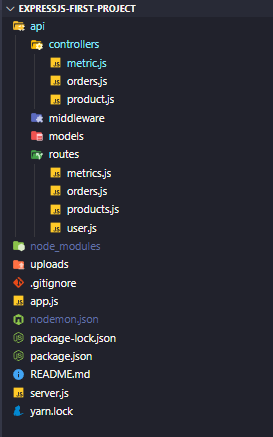

# Setup prometheus and grafana

**docker-compose** file

```yml
version: "3"

volumes:
    prometheus-data:
        driver: local
    grafana-data:
        driver: local

services:
    prometheus:
        image: prom/prometheus:latest
        container_name: prometheus
        ports:
            - "9090:9090"
        volumes:
            - /etc/prometheus:/etc/prometheus
            - prometheus-data:/prometheus
        restart: unless-stopped
        command:
            - "--config.file=/etc/prometheus/prometheus.yml"

    grafana:
        image: grafana/grafana:latest
        container_name: grafana
        ports:
            - "3000:3000"
        volumes:
            - grafana-data:/var/lib/grafana
        environment:
            - "GF_SMTP_ENABLED=true"
            - "GF_SMTP_HOST=smtp.gmail.com:587"
            - "GF_SMTP_USER=user1@gmail.com"
            - "GF_SMTP_PASSWORD=mysamplePassword"
            - "GF_SMTP_FROM_ADDRESS=user1@gmail.com"
            # - "GF_SERVER_DOMAIN=grafana.my.domain"
            # - "GF_SERVER_ROOT_URL=grafana.my.domain"
        restart: unless-stopped
    node_exporter:
        image: quay.io/prometheus/node-exporter:latest
        container_name: node_exporter
        command:
            - "--path.rootfs=/host"
        pid: host
        restart: unless-stopped
        volumes:
            - /:/host:ro
    cadvisor:
        image: google/cadvisor:latest
        container_name: cadvisor
        # ports:
        #   - "8080:8080"
        volumes:
            - /:/rootfs:ro
            - /var/run:/var/run:ro
            - /sys:/sys:ro
            - /var/lib/docker/:/var/lib/docker:ro
            - /dev/disk/:/dev/disk:ro
        devices:
            - /dev/kmsg
```

**prometheus.yml** file

```yml
global:
    scrape_interval: 15s # By default, scrape targets every 15 seconds.

    # Attach these labels to any time series or alerts when communicating with
    # external systems (federation, remote storage, Alertmanager).
    # external_labels:
    #  monitor: 'codelab-monitor'

# A scrape configuration containing exactly one endpoint to scrape:
# Here it's Prometheus itself.
scrape_configs:
    # The job name is added as a label `job=<job_name>` to any timeseries scraped from this config.
    - job_name: "prometheus"
      # Override the global default and scrape targets from this job every 5 seconds.
      scrape_interval: 5s
      static_configs:
          - targets: ["localhost:9090"]

    # Example job for node_exporter
    - job_name: "node_exporter"
      static_configs:
          - targets: ["node_exporter:9100"]

    # Example job for cadvisor
    - job_name: "cadvisor"
      static_configs:
          - targets: ["cadvisor:8080"]

    # Example custom an metrics api
    - job_name: "express_app"
      static_configs:
          - targets: ["172.168.15.180:3001"] # "[ip or domain]:[port app]"
```

## Custom an metrics - api from expressjs app

Create an expressjs app. Structure like this:

<p align="center">

</p>

Install package:

```bash
yarn add prom-client
```

code in **_/controller/metric.js_**

```js
const promethusClient = require("prom-client");

const collectDefaultMetric = promethusClient.collectDefaultMetrics;

collectDefaultMetric({ timeout: 5000 });

// Todo: init object counter, you can import in other controller file to count request call
exports.counter = new promethusClient.Counter({
    name: "node_request_oper_total",
    help: "Total number of processed requests",
});

exports.histogram = new promethusClient.Histogram({
    name: "node_request_duration_second",
    help: "Total number of processed requests",
    buckets: [1, 2, 5, 6, 10],
});

exports.metrics = (req, res) => {
    try {
        res.set("Content-Type", promethusClient.register.contentType);
        promethusClient.register
            .metrics()
            .then((metrics) => {
                res.send(metrics);
            })
            .catch((error) => {
                console.error("Error retrieving metrics:", error);
                res.status(500).send("Error retrieving metrics");
            });
    } catch (err) {
        console.log(err);
    }
};
```
